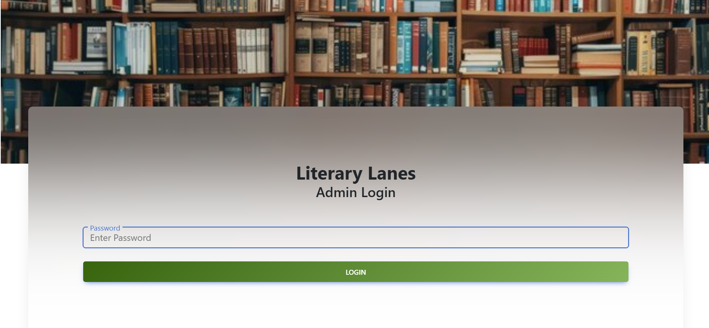
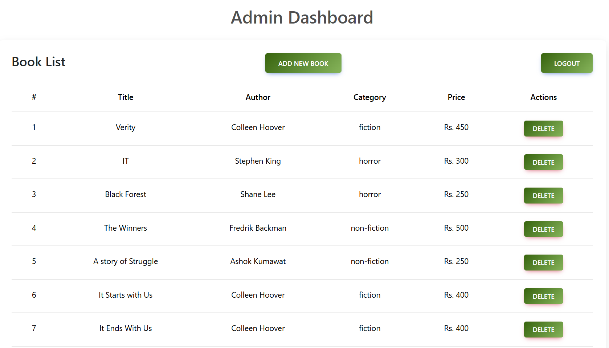

# LiteraryLanes - Dynamic MERN Bookstore Web App

**LiteraryLanes** is a dynamic full-stack bookstore web application built with the MERN stack (MongoDB, Express.js, React, Node.js). It allows users to purchase books online in real-time, with features like live book uploads, a responsive design, and a secure payment gateway.

---

## Features

- **Dynamic Book Uploads:** Admin can add, update, or delete books in real-time.
- **User Authentication:** Sign up, login, and manage personal accounts.
- **Stripe Payment Gateway:** Secure online payments for orders.
- **Responsive Design:** Works smoothly on desktops, tablets, and mobile devices.
- **Admin Dashboard:** Full CRUD operations to manage books, categories, and orders.
-  **Checkout:** Users can  complete purchases securely.

---

## Tech Stack

| Layer       | Technology       |
|------------|-----------------|
| Frontend   | React, Bootstrap |
| Backend    | Node.js, Express.js |
| Database   | MongoDB          |
| Authentication | JWT / bcrypt |
| Payments   | Stripe           |

---

## Screenshots

**Homepage:**  

**Admin Login:**  

**Admin Dashboard:**  

**Product Page:**  

